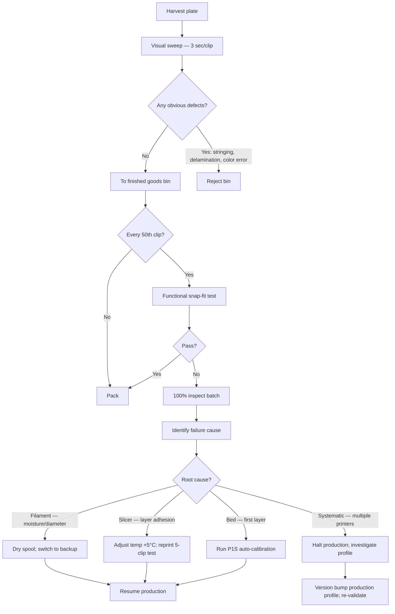
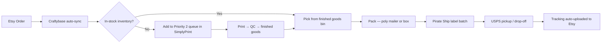
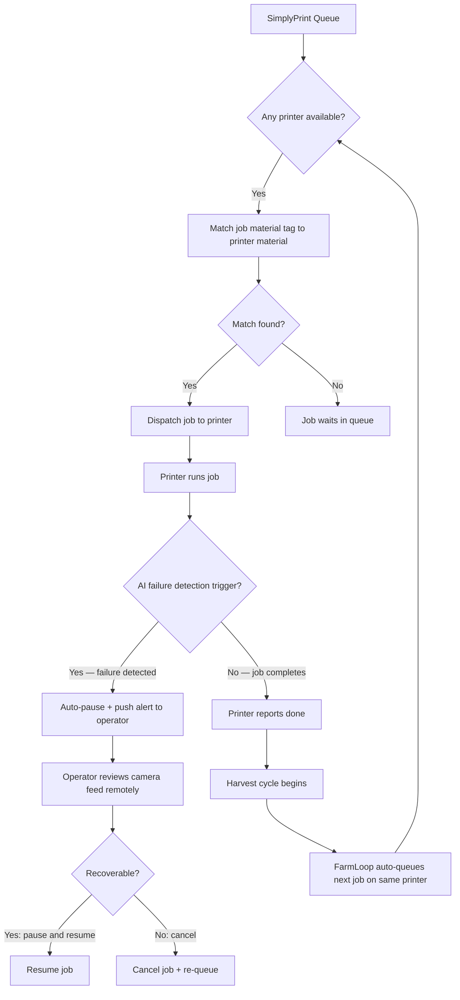

# ModRun Manufacturing Automation & Multi-Printer Scaling Architecture

**Lead finding:** The binding constraint in scaling from 1 to 5 printers is not hardware cost (printer payback is measured in weeks, not months) — it is **process systematization before multiplication**. Every operator who adds printers before automating their single-machine workflow reports that complexity grows faster than revenue. The architecture in this document is designed to be installed in the correct sequence: single-printer automation first, then multi-printer orchestration, then labor optimization. Deviating from this order is the most common cause of print farm stagnation.

**Gate status:** This document is ready to use post-test-print. Section 1 (file pipeline) and Section 4 (orchestration) can be partially implemented immediately. Full implementation begins when the test print validates the ModRun design geometry and establishes the baseline print time and material usage that anchors all cost models.

---

## Section 1: Manufacturing Workflow Automation

### 1.1 File Preparation Pipeline

The production file pipeline runs from CadQuery source to a validated, sliced, farm-ready 3MF file. The pipeline should be treated as a one-time setup that produces a frozen production artifact — the production 3MF. Once validated, it does not change unless the design changes.

**Stage 1: CAD → STL export**

CadQuery scripts export STL via `shape.exportStl("modrun-clip-v1.stl", tolerance=0.01, angularTolerance=0.1)`. Tolerance 0.01mm is sufficient for cable clips; tighter tolerances add vertices with no print benefit. Keep one canonical STL per design revision in version-controlled storage (a `/stl/production/` folder in the mfg-farm project, not in the active working directory). Name files with version and date: `modrun-clip-v1.2-2026-04-27.stl`.

**Stage 2: Slicer profile lock-in**

In BambuStudio (or OrcaSlicer for greater parameter control), create a production profile for the P1S. Key parameters to lock and document:

| Parameter | Value | Rationale |
|---|---|---|
| Layer height | 0.20mm | Balance of speed and layer adhesion for functional clips |
| Wall loops | 4 | Adequate strength for flex-to-install clips; reduces over-use of material |
| Infill | 20% gyroid | Gyroid distributes load omnidirectionally; better than grid for snap-fit parts |
| Print speed | 200mm/s outer, 300mm/s inner | P1S production sweet spot; slower outer walls improve surface finish |
| Supports | None | Design clips to be self-supporting; eliminates post-processing step entirely |
| Brim | 3mm (removable) | Improves bed adhesion on first layer; peel away cleanly on flexible PEI plate |
| Seam | Back-aligned | Moves seam artifact to least visible face of the clip |
| Cooling | Full fan after layer 3 | PLA needs rapid cooling for layer definition; skip early layers to aid bed adhesion |

Save this as a named process preset: `ModRun-PLA-Production-v1`. Lock the preset — do not allow ad hoc changes during production runs. Changes to the production profile require an explicit version bump and a test print validation cycle.

**Stage 3: Plate batching**

The highest-leverage slicer decision is plate composition. A build plate loaded with 10–14 clips prints in approximately 65–80 minutes and yields 10–14 units. A plate loaded with 1 clip prints in 40 minutes and yields 1 unit. At 16 operating hours per printer per day:

- 1 clip per plate: ~24 plate cycles = 24 units/day/printer
- 12 clips per plate: ~12 plate cycles = 144 units/day/printer

The throughput difference is 6x for the same hardware and labor cost. Plate batching is the single most important manufacturing decision. For the ModRun clip geometry, 12–14 clips per 256x256mm P1S build area is achievable in a 3-row grid with 8mm clearance between parts.

Save the 12-clip plate as a separate production 3MF: `modrun-plate-12x-production-v1.3mf`. This is the farm's primary job file.

**Stage 4: Material assignment for AMS**

Each production 3MF is tagged with its filament profile: brand (eSUN PLA+), color code (e.g., Cool White, Pure Black, Ash Grey), and spool diameter (1.75mm). In Bambu Farm Manager and SimplyPrint, these tags become the job routing criteria: a job tagged `eSUN-PLA+-Pure-Black` will only auto-assign to a printer with a matching spool loaded. This prevents color cross-contamination without manual verification.

**Stage 5: Job library management**

Maintain a small, disciplined job library. At launch: 3 files (12-clip plate, 6-clip plate for short runs, 1-clip test plate). Each file exists in three color variants (black, white, grey) = 9 job files total. Every new SKU adds 3 files. A library exceeding 20 files without a clear naming convention becomes unmanageable. Use the format: `[product]-[quantity]x-plate-[color]-v[N].3mf`.

---

### 1.2 Print Queue Management

**Recommended stack: SimplyPrint (primary) + Bambu Farm Manager (local backup)**

SimplyPrint integrates with Bambu printers via the Bambu MQTT API (same interface used by BambuStudio). The SimplyPrint client runs locally, bridging each printer to the SimplyPrint cloud dashboard. Key capabilities for ModRun:

- Central print queue with drag-and-drop job prioritization
- Automatic job dispatch to the next available printer matching the job's material tag
- AI failure detection (12 free hours/month included; add-on pricing applies above that threshold) detecting spaghetti, warping, and blob formation from printer camera feeds
- Mobile push notifications on failure detection or job completion
- FarmLoop integration: auto-queues the next job on a printer immediately after the previous job completes, without operator intervention

Bambu Farm Manager (free, local-only, Windows) serves as the fallback dashboard when SimplyPrint is unavailable and as the primary tool for firmware updates, batch calibration commands, and Schedule View (the visual timeline of printer workloads across the fleet). It does not require internet connectivity, which matters for overnight automation when a network outage should not stop production.

For operations that scale beyond 5 printers and require Etsy order-direct routing, evaluate **Printago** (Bambu Lab native integration, Etsy/Shopify order queue) or **AutoFarm3D** (3DQue, $0/month free tier for under 3 printers, $40/month Pro for up to 25, with QuinlyVision AI failure detection and auto-eject hardware integration).

**Priority queue logic (implemented in SimplyPrint):**

```
Priority 1: Committed Etsy orders with ship-by date within 48 hours
Priority 2: Low inventory restocking (any top-3 SKU below 20 units in stock)
Priority 3: Standard production batch (maintaining 2-week inventory buffer)
Priority 4: New SKU testing / prototype runs
```

This queue is configured as a static rule set in SimplyPrint's AutoPrint settings. Priority 1 jobs use the "rush" tag applied manually when an Etsy order comes in with a short ship window. The system handles the rest automatically.

---

### 1.3 Post-Processing Workflow

**Target: zero post-processing for standard ModRun clips.**

This requires the design to be self-supporting and the slicer profile to be tuned so parts pop off the PEI plate cleanly without tools. The test print validation is the moment to confirm this. If the design requires:

- Supports: redesign the geometry to eliminate them. Supports on functional clips increase post-processing time by 30–60 seconds per clip and introduce surface finish inconsistency at the support interface.
- Brim removal: flexible PEI plates eject PLA brims with a flex-snap; no tools needed. Budget 2 seconds per clip at harvest.
- Sanding or seam correction: the seam placement in the production profile should put the seam on the non-visible inside face. If seam artifacts are visible, adjust seam position setting before locking the production profile.

**Harvest workflow (target: 30 seconds per plate):**

1. Flex PEI plate slightly — clips release cleanly from flexible surface
2. Sweep clips into the harvest bin with a single hand motion
3. Visual scan: check for obvious failures (stringing across bridge gaps, visible layer separation) — 3 seconds
4. Reload plate to printer and confirm next job queues automatically in SimplyPrint
5. Move harvest bin to QC station

For a 12-clip plate, harvest + reload target is under 45 seconds per cycle. At 16 plates/day across 5 printers, this is approximately 60 minutes of daily harvest labor total — manageable as part of a 2-hour morning shift.

**Auto-eject option (Phase 2):** The 3DQue AutoFarm3D Door Opener ($129/printer kit + $9.99–$40/month software) automates plate ejection for enclosed Bambu printers (P1S, X1C, X1E). The system opens the printer door after a completed job, uses the toolhead to clear parts off a VAAPR release bed, then closes the door and starts the next job — unattended, continuously. At 5 printers × $129 + software = $645 in hardware and $50–200/month in software, auto-eject pays for itself when it enables a single overnight run to produce 200+ units without operator presence. Activate this in Phase 2 when overnight unattended production becomes the constraint.

---

## Section 2: Quality Control Architecture

### 2.1 Acceptance Criteria — Quantitative Standards

Quality control for ModRun cable clips should be measurable, fast to execute, and enforceable without adding more than 10% labor overhead per batch. The following acceptance criteria are the production standard:

**Dimensional tolerance:**
| Dimension | Nominal | Acceptable Range | Reject if |
|---|---|---|---|
| Clip width (cable channel) | Design nominal | ±0.5mm | >0.5mm deviation |
| Clip depth (mount face) | Design nominal | ±0.3mm | >0.3mm deviation |
| Snap-arm thickness | Design nominal | ±0.4mm | >0.4mm deviation; visible under-extrusion |
| Overall length | Design nominal | ±0.5mm | >0.5mm deviation |

Note: FDM on a well-calibrated P1S achieves ±0.1–0.2mm repeatability under controlled conditions. The ±0.3–0.5mm acceptance band is deliberately wider to account for minor environmental variation (filament diameter batch variation, ambient temperature changes) without creating excessive reject rates. For cable management clips with functional fit tolerances in the 0.5–1.0mm range, this band is sufficient.

**Layer adhesion:**
Accept parts where no visible inter-layer gaps appear under normal indoor lighting. Reject parts showing visible delamination (layers separating at part edges or surfaces), whitening at layer interfaces under slight flex, or audible cracking on snap-arm flex test.

**Surface finish:**
Accept: minor layer lines (inherent to FDM), uniform color, no stringing across open features, seam on non-visible face.
Reject: stringing across cable channel opening (functional interference), significant underextrusion on outer walls (visible gaps in surface), burn marks from nozzle dwell, color contamination from prior filament residue.

**Functional test (sampled, not 100%):**
Every 50th clip from production: snap-fit flex test. Install clip onto a representative cable diameter (measure the target cable size from product listing). The clip should seat without cracking. This is the acceptance test for layer adhesion under real use stress. A single failure triggers a 100% inspection of the batch and a slicer parameter review.

---

### 2.2 QC Gate Flow



**QC labor budget:** At 144 units/printer/day (12-clip plate batches), a 5-printer operation produces 720 units/day. At 3 seconds per visual inspection = 36 minutes for 720 units. Functional sampling at 1 test per 50 clips = approximately 15 tests × 30 seconds each = 7 minutes. Total QC overhead: approximately 45 minutes/day for 720 units. This is 6% of an 8-hour shift — within the 10% overhead target.

---

### 2.3 Printer Calibration Protocol

A poorly calibrated printer produces clips that fail QC at systematically higher rates. Calibration prevents QC failures rather than catching them. The calibration schedule for the P1S fleet:

**Daily (2 minutes per printer):**
- Visual check: bed surface for PEI wear, nozzle for burnt filament residue
- Confirm first layer of first plate — watch for bed adhesion quality before leaving overnight runs unattended

**Weekly (15 minutes per printer):**
- Run P1S automatic flow calibration (built-in, triggered from printer menu)
- Check AMS hub for filament tangles or tension issues
- Inspect spool weight / remaining filament estimate; reorder trigger if below 200g on primary production colors

**Monthly (30 minutes per printer, staggered so not all printers down simultaneously):**
- Run full automatic calibration suite: vibration compensation, flow rate, first layer scan
- Clean nozzle with cold-pull technique (especially if any stringing or underextrusion noted)
- Check belts for tension (audible ping test)
- Replace hotend filter if printing PLA >400 hours since last replacement

**Version-controlled calibration log:** Keep a simple spreadsheet per printer (P1–P5): date, calibration type performed, filament brand loaded, any anomaly noted. This log is diagnostic data — if P3 starts producing high reject rates, the log shows whether a recent calibration or filament switch correlates.

---

### 2.4 Defect Rate Targets and Margin Impact

| Defect Rate | Impact at 720 units/day | Monthly reject cost (at $1.55 COGS/unit) | Action threshold |
|---|---|---|---|
| <2% (target) | <15 rejects/day | <$700/month | Normal operations |
| 2–5% | 15–36 rejects/day | $700–$1,700/month | Investigate root cause within 48 hours |
| >5% | >36 rejects/day | >$1,700/month | Halt production; mandatory profile review |

PLA on a well-maintained Bambu P1S should achieve under 2% defect rate in stable conditions. Material moisture and first-layer calibration are the two most common culprits for rates above 2%.

---

## Section 3: Fulfillment and Logistics Optimization

### 3.1 Order-to-Fulfillment Workflow



**Daily fulfillment cycle (target: 2 hours for 50 orders):**

- 8:00am: Harvest overnight batch, run QC sweep, add to finished goods bin
- 8:45am: Pull Etsy orders into Pirate Ship (via automatic Etsy integration sync)
- 9:00am: Batch print labels — select all pending orders, generate labels in one pass
- 9:15am: Pack orders in sequence — single clips in 9x12" poly mailers, bundles in 12x15.5"
- 10:00am: USPS pickup (if using USPS scheduled pickup, free) or drop-off run

At 50 orders this workflow runs in approximately 2 hours with practice. At 100+ orders/day, a part-time packing assistant (15–20 hours/week at $18/hour) covers the packing step while the operator focuses on harvest, queue management, and customer service.

---

### 3.2 Batch Consolidation Logic

Shipping cost is the dominant P&L lever for single-unit orders. The consolidation strategy minimizes shipping events per unit:

**Rule 1: Same-customer multi-SKU consolidation.** If a customer orders 2 different clip variants, ship in one package. Pirate Ship's order interface groups by recipient address. Consolidated shipping saves $4–6 in USPS costs and increases perceived quality.

**Rule 2: Production batching by color and SKU.** Instead of printing one color per day, batch all black orders into a full-plate run, then white, then grey. This minimizes spool changes, AMS purge waste (approximately 2–3g of purge filament per color switch), and slicer profile context-switching.

**Rule 3: Inventory buffer for top-SKUs.** Maintain a 2-week inventory buffer on the top-3 selling SKUs (by velocity). This decouples order fulfillment from print production on your highest-volume items — orders ship same-day from stock, not next-day from a print run. The buffer size: 2 weeks × daily demand. At 50 black clips/day demand, buffer = 700 clips. At 75g/clip and $0.60/g material cost (bulk), this buffer costs approximately $32 in material. Worth it for the fulfillment speed advantage.

**Rule 4: Etsy Star Seller compliance.** Etsy's Star Seller badge requires >95% of orders shipped with tracking within 3 business days. This is a ranking signal. Production queue Priority 1 (committed ship-by date within 48 hours) is explicitly designed to protect this metric.

---

### 3.3 Packaging Automation

**Label printing setup:**

Rollo X1040 thermal label printer (~$100) with Pirate Ship web interface. Labels cost ~$0.02 each. The Rollo integrates with Pirate Ship's batch print function — select all pending orders, click print, 50 labels in 3 minutes. Zero label design work; Pirate Ship generates USPS-compliant labels automatically.

**Packing station layout:**

Dedicated flat surface (South wall, see multi-printer-architecture.md Section 1.3) with:
- Postal scale ($25–40, minimum 10kg capacity, 1g resolution) — verify package weight before printing label for accuracy
- Rollo label printer
- Stock of 9x12" poly mailers (primary) and 12x15.5" mailers (bundles) within arm's reach
- Tape gun loaded
- Outbound bin for completed packages awaiting USPS pickup

This layout allows packing one order per 45–90 seconds with practice.

**Inventory tracking — Craftybase:**

Craftybase (Studio plan at $20/month, 250 orders/month; Indie plan at $45/month for 1,000 orders/month) provides:
- Etsy order sync with automatic inventory deduction per sale
- COGS tracking that updates in real time as material costs change — critical for tax-ready profit reporting on Schedule C
- Batch manufacturing records: log each print plate as a "batch" with filament weight, color, and cost
- Low-stock alerts triggering restock notifications

This replaces a manual spreadsheet for inventory management. At 100+ orders/month, the time savings justify the subscription cost.

---

### 3.4 Shipping Integration

**Pirate Ship configuration for ModRun:**

Create saved package presets:
- "Single Clip": 9x12" poly mailer, 6oz (conservative), Ground Advantage
- "3-Pack Bundle": 12x15.5" poly mailer, 12oz, Ground Advantage
- "6-Pack Premium": custom box dimensions, Priority Mail Cubic

The Pirate Ship Etsy integration pulls all open orders automatically. Each incoming order is matched to a package preset by SKU (1-unit → Single Clip preset, 3-unit bundle → 3-Pack preset). This eliminates manual weight entry for 95% of orders.

**Rate optimization:**

| Product | Package | Service | Blended est. cost (zones 1–5) |
|---|---|---|---|
| 1 clip ($12 sale) | 6oz poly mailer | Ground Advantage | $4.00–5.50 |
| 3-pack ($28 sale) | 12oz poly mailer | Ground Advantage | $5.58–7.00 |
| 6-pack ($45 sale) | Custom box | Priority Mail Cubic | $6.00–8.00 |

The 6-pack in Priority Mail Cubic is the highest-margin order type: shipping cost is nearly identical to a 3-pack while revenue is 60% higher and COGS only 2x the 3-pack. Prioritize bundle SKU promotion in Etsy listings.

---

### 3.5 3PL Transition Thresholds

Self-fulfillment is the correct approach through approximately 7,000 units/month. The following thresholds trigger 3PL evaluation:

| Signal | Threshold | Recommended action |
|---|---|---|
| Packing time exceeds 4 hr/day | >200 orders/day | Hire part-time packing assistant before 3PL |
| Operator doing >6 hr/day on operations | Month 5–7 | Evaluate Simpl Fulfillment or ShipMonk |
| Amazon channel exceeds 50 orders/day | Any time | Activate Amazon FBA for top 2 Amazon SKUs |
| Monthly unit volume exceeds 7,000 | — | Full 3PL evaluation with Simpl Fulfillment |

Do not engage a 3PL before 7,000 units/month. 3PLs add margin-layer complexity (per-pick fees, storage fees, postage markup) that is disadvantageous at small scale. A part-time assistant at $18/hour is more cost-effective than a 3PL until volume forces the economics to flip.

---

## Section 4: Multi-Printer Orchestration

### 4.1 Load Balancing Strategy

The fundamental load balancing rule for a 2–5 printer Bambu fleet is: **every printer should be printing at all times during operating hours, and printers should never wait on operator decisions.**

This requires:
1. A persistent print queue that always has at least 2 jobs ready to dispatch per printer
2. Automatic job assignment based on printer availability and material match
3. Failure alerts that trigger remediation without stopping other printers

**Material-based printer assignment:**

For a 3-color operation (black, white, grey), assign colors semi-permanently to printers rather than switching per-job:

| Printer | Primary Color | Secondary Color | Rationale |
|---|---|---|---|
| P1 | Black (eSUN PLA+) | Black (backup) | Black is highest velocity; P1 runs continuously |
| P2 | White (eSUN PLA+) | White (backup) | White is second-highest velocity |
| P3 | Grey (eSUN PLA+) | Black (overflow) | Grey; overflow black when P1 falls behind |
| P4 | Any color (queue-managed) | — | Flex printer; takes backlog jobs from any color |
| P5 | New SKU / PETG / testing | Production overflow | Experimentation + overflow; first to flex |

This assignment is semi-permanent, not rigid. When P1 has a maintenance window, P3 or P4 absorbs black production. The assignment is recorded in SimplyPrint as printer tags so the system enforces the material match automatically.

**Idle time elimination:**

The most expensive printer state is idle-while-operational. Causes and remedies:

| Cause | Symptom | Remedy |
|---|---|---|
| Empty queue | Printer sits at home screen | Always maintain 5+ jobs queued per active printer |
| Spool runout without AMS backup | Print pauses | Load AMS with a backup spool of the same color; enable runout switching |
| Failure detection pause | Job cancelled, printer waiting | SimplyPrint auto-queues next job after cancellation; operator re-queues the failed job |
| Bed surface fouled | First layer fails repeatedly | Hot-swap spare PEI plate (keep 2 per printer); send fouled plate for cleaning offline |

---

### 4.2 Multi-Printer Orchestration Flow



**Alert routing:**

SimplyPrint mobile app push notifications are the primary alert channel. Notification types and expected operator response time:

| Alert | Priority | Expected Response |
|---|---|---|
| Spaghetti/failure detected | High | Within 10 minutes; cancel job remotely if unrecoverable |
| Job complete — harvest needed | Normal | Within 2 hours; harvest when convenient during operating hours |
| Spool low (<100g remaining) | Normal | Within 4 hours; load backup spool before next plate |
| Printer offline / disconnected | High | Within 30 minutes; check network or power |
| Calibration required | Low | Next scheduled maintenance window |

For overnight runs, only High priority alerts should trigger a phone notification. Normal alerts queue for morning review. Configure SimplyPrint notification settings accordingly.

---

### 4.3 Job Scheduling — Daily Cycle

**Recommended daily operating cycle for a 5-printer farm:**

| Time | Activity |
|---|---|
| 7:00am | Wake cycle: harvest overnight batch (30 min), run QC sweep, reload plates |
| 7:30am | Start morning print session: all 5 printers running |
| 9:00am | Fulfill Etsy orders shipped out (Pirate Ship batch label print, pack, stage for USPS pickup) |
| 11:00am | Check printer status; address any morning failure alerts |
| 2:00pm | Mid-day harvest of morning plates (12 clips/plate × 5 printers × ~2 cycles = 120 clips) |
| 3:00pm | Reload for afternoon/evening session |
| 5:00pm | Final operator-present harvest before overnight |
| 6:00pm | Load overnight batch: top up all spools, verify AMS backup spools loaded, confirm queue has 5+ jobs per printer |
| 6:30pm | Start overnight session (unattended, 12-hour run) |

Total operator time at 5 printers: approximately 4–6 hours/day split between production management (2–3 hours) and fulfillment (2–3 hours). This is consistent with the labor model in multi-printer-architecture.md Section 4.5.

**Labor becomes binding at Month 5–6** (5-printer steady state, 200+ orders/day). The first hire should cover packing and shipping (15–20 hrs/week, $18/hour = $1,080–$1,440/month). This frees the operator to focus on queue management, QC, design, and customer service.

---

### 4.4 Failure Decision Tree

```mermaid
flowchart TD
    A[Printer alert or anomaly] --> B{Type of failure?}
    B -->|Spaghetti / first layer failure| C[Cancel job remotely; inspect camera still image]
    B -->|Stringing / surface quality| D[Let job complete; inspect at harvest; adjust retraction if systematic]
    B -->|Color contamination| E[Cancel job; run AMS purge cycle; reprint]
    B -->|Printer offline| F[Check local network; power cycle printer; check Bambu Farm Manager local connection]
    B -->|Repeated first-layer failures on one printer| G[Run full auto-calibration; check PEI plate for damage]
    C --> H{Was it early in the job (<20% complete)?}
    H -->|Yes| I[Re-queue same job immediately; loss is minimal]
    H -->|No| J[Re-queue + review camera feed for root cause; flag printer for calibration check]
    D --> K[If stringing persists across 3 plates on same printer: adjust retraction distance +0.5mm; retest]
    G --> L{Calibration resolves?}
    L -->|Yes| M[Resume production]
    L -->|No| N[Swap PEI plate; if unresolved — mark printer offline; investigate nozzle / hotend]
```

The decision tree keeps one printer's problem from impacting the other four. A single offline printer represents 20% capacity loss at 5 printers — significant but not catastrophic. Maintaining a spare PEI plate per printer and one spare nozzle (P1S uses standard 0.4mm brass) prevents single-component failures from causing extended downtime.

---

## Section 5: Cost Model — Unit Cost as a Function of Scale

### 5.1 Parametric Cost Model

The unit cost model is parameterized across five variables: batch size (clips per plate), printer utilization (%), number of printers, material cost ($/kg), and labor hours (burdened at $18/hour). All models assume the ModRun clip at 75g PLA and 40-minute print time.

**Base cost components (per unit, at baseline assumptions):**

| Component | Formula | Baseline value |
|---|---|---|
| Material (PLA) | (weight_g / 1000) × price_per_kg × (1 + failure_rate) | 75/1000 × $11.50 × 1.05 = **$0.906** |
| Electricity | (watts / 1000) × hours × rate | (180/1000) × 0.667 × $0.17 = **$0.020** |
| Printer depreciation | (purchase_price / life_hours) × hours | ($699/5000) × 0.667 = **$0.093** |
| Consumables | blended rate × hours | $0.02 × 0.667 = **$0.013** |
| **Manufacturing COGS** | | **$1.032** |
| Packaging | per unit | **$0.08** (poly mailer at $0.05 + tissue) |
| Platform fees (Etsy $12 sale) | 6.5% + 3% + $0.25 | **$1.33** |
| Shipping (blended zone average) | Pirate Ship Ground Advantage | **$5.00** |
| **Total landed cost (1-unit $12 order)** | | **$7.44** |
| **Net per unit** | | **$4.56 (38%)** |

Note: This baseline uses $11.50/kg bulk filament (eSUN 10kg bundle, blended black/white/grey pricing) and Pirate Ship commercial rates, which improves on the $1.15/$8.49 model in multi-printer-architecture.md by incorporating bulk material pricing and commercial shipping rates established in phase-2-supplier-research.md.

---

### 5.2 Unit Cost vs. Batch Size

The plate batch size is the most controllable variable. This table shows COGS per unit as a function of clips per plate, holding all other variables constant:

| Clips per plate | Plate time (min) | Print time per clip (min) | Machine cost/clip | Material/clip | COGS/clip |
|---|---|---|---|---|---|
| 1 | 40 | 40.0 | $0.187 | $0.906 | $1.093 |
| 4 | 55 | 13.8 | $0.065 | $0.906 | **$0.971** |
| 8 | 65 | 8.1 | $0.038 | $0.906 | **$0.944** |
| 12 | 75 | 6.3 | $0.029 | $0.906 | **$0.935** |
| 14 | 80 | 5.7 | $0.027 | $0.906 | **$0.933** |

The diminishing returns above 8 clips per plate are real — the machine cost reduction from 8→12 clips is only $0.009/clip. The plate batching leverage is largest going from 1→4 clips (a 12% COGS reduction). Plate size above 8 clips is still worth doing for throughput, not unit cost.

---

### 5.3 Unit Cost vs. Printer Utilization

Printer utilization captures idle time (planned downtime, harvest gaps, failures). Labor cost per unit is the most utilization-sensitive variable because labor is fixed whether the printer runs or not.

This model assumes one operator at $18/hour managing N printers, working 6 hours/day on production activities.

| Utilization | Clips/printer/day (12-clip plate) | Total clips/day (5 printers) | Labor cost/clip | COGS/clip (mfg only) | Labor + COGS |
|---|---|---|---|---|---|
| 60% | 72 | 360 | $0.150 | $0.935 | $1.085 |
| 75% | 90 | 450 | $0.120 | $0.935 | $1.055 |
| 85% (target) | 102 | 510 | $0.106 | $0.935 | **$1.041** |
| 95% | 114 | 570 | $0.095 | $0.935 | $1.030 |

Labor assumptions: 1 operator, 6 hours production activities/day = $108/day. Divided by daily clips at each utilization level.

At 85% utilization (realistic target with failure detection, AMS runout switching, and overnight batches), labor cost per clip is approximately $0.11. Below 70% utilization, labor overhead becomes a meaningful COGS driver — the argument for automation investments (SimplyPrint, auto-eject) is to keep utilization at 85%+.

---

### 5.4 Unit Cost vs. Number of Printers

Adding printers allows labor cost to be spread across more units, while fixed overhead (software, equipment, space) scales sub-linearly.

| Printers | Clips/day (85% util, 12-clip plate) | Labor cost/clip ($108/day) | Software + overhead/clip | COGS/clip | Total landed ($12 sale) | Net margin |
|---|---|---|---|---|---|---|
| 1 | 102 | $1.059 | $0.024 | $0.935 | $8.44 | 30% |
| 2 | 204 | $0.529 | $0.012 | $0.935 | $7.91 | 34% |
| 3 | 306 | $0.353 | $0.008 | $0.935 | $7.72 | 36% |
| 5 | 510 | $0.212 | $0.005 | $0.935 | $7.58 | 37% |
| 5 + assistant | 510 | $0.530 | $0.005 | $0.935 | $7.90 | 34% |

Note: "5 + assistant" assumes the part-time packing assistant ($18/hour × 20 hours/week = $360/week = $1,440/month) is added. The 3% margin compression from adding an assistant is more than recovered by the freed operator time, which enables revenue-generating activities (design, SEO, customer service) rather than packing boxes.

**Key insight:** The margin improvement from scaling 1→5 printers is approximately 7 percentage points — meaningful but modest. The real leverage is on the revenue side (AOV growth via bundles, second-channel revenue via Amazon, B2B bulk orders) rather than the COGS side. At $12 single-unit pricing, margins are acceptable but tight. At $28 bundle pricing, margins are excellent regardless of scale.

---

### 5.5 Material Cost Sensitivity

Material cost is controllable via supplier selection. This table shows COGS impact of moving through the sourcing phases defined in phase-2-supplier-research.md:

| Phase | Supplier | $/kg | COGS impact per clip (75g) | Monthly COGS at 10K clips |
|---|---|---|---|---|
| Launch (retail spool) | eSUN 1kg Amazon | $15.00 | $1.181 | $11,810 |
| Phase 1 (10kg bundle) | eSUN 10kg Amazon | $11.50 | $0.906 | $9,060 |
| Phase 2 (Anycubic pallet) | Anycubic 50kg direct | $10.49 | $0.826 | $8,260 |
| Phase 3 (direct wholesale) | eSUN direct 40kg/month | $9.00–10.00 | $0.709–0.788 | $7,090–7,880 |
| Phase 3 (Polymaker quality tier) | Polymaker wholesale | $14.99 | $1.181 | $11,810 |

The material cost difference between retail single-spools and Phase 2 pallet pricing is **$0.355/clip** — which at 10,000 clips/month represents **$3,550/month in retained margin**. This is the single largest COGS lever available and it requires only a supplier decision, not a capital investment.

---

### 5.6 Break-Even Analysis

**Scenario: 5-printer operation, 85% utilization, 12-clip plates, eSUN Phase 1 pricing ($11.50/kg)**

**Fixed monthly costs:**

| Item | Monthly cost |
|---|---|
| Printer depreciation (5 × P1S, 5-year life) | $58 |
| Electricity (5 printers × 16 hr/day × 30 days × 0.18kW × $0.17) | $147 |
| Software (SimplyPrint farm plan + Craftybase Indie) | $75 |
| Packaging materials (poly mailers, labels, tape) | $200 |
| Maintenance and consumables | $90 |
| **Total fixed overhead** | **$570/month** |

**Variable costs per unit (at $12 single-unit sale price, Pirate Ship shipping):**

| Component | Per unit |
|---|---|
| Material COGS | $0.906 |
| Platform fees (Etsy) | $1.33 |
| Shipping (Pirate Ship commercial) | $5.00 |
| Packaging | $0.08 |
| **Total variable cost** | **$7.316** |

**Contribution margin per unit:** $12.00 − $7.316 = **$4.684**

**Break-even units/month:** $570 / $4.684 = **122 units/month**

This is achievable in Month 1 with a single printer. A 5-printer operation at full utilization produces this many units in approximately 2.5 hours.

**Target operating points and monthly P&L:**

| Scenario | Monthly units | Revenue | Variable costs | Fixed overhead | Labor (part-time at scale) | Net profit | Net margin |
|---|---|---|---|---|---|---|---|
| 1 printer, startup | 1,500 | $18,000 | $10,974 | $114 | $0 | $6,912 | 38% |
| 3 printers, growing | 5,000 | $60,000 | $36,580 | $342 | $600 | $22,478 | 37% |
| 5 printers, target | 10,000 | $120,000 | $73,160 | $570 | $1,440 | $44,830 | 37% |
| 5 printers + bundles | 10,000 | $180,000* | $95,000* | $570 | $1,440 | $82,990* | 46% |

*Bundle scenario assumes 40% of sales are 3-pack bundles at $28 (higher revenue per unit, slightly better shipping economics). The mix shift to bundles is the highest-ROI revenue action.

**Note on revenue assumptions:** The "10,000 units/month" scenarios above represent maximum production capacity at 5 printers, not expected demand at launch. Demand is the constraint, not supply. The realistic demand model from multi-printer-architecture.md Section 4.2 shows 600–900 orders/month at the scaling stage (5 printers, established shop). These P&L tables represent the ceiling, not the floor.

---

### 5.7 Margin Optimization Priority Stack

Ranked by implementation ease and margin impact:

| Rank | Action | Margin improvement | Implementation effort |
|---|---|---|---|
| 1 | Migrate to bulk filament ($15 → $11.50/kg) | +3% | Immediate (Amazon bundle order) |
| 2 | Shift 30% of sales to 3-pack bundles | +5–8% | 2 weeks (Etsy listing + photography) |
| 3 | Use Pirate Ship commercial rates (vs. retail USPS) | +1.5% | Immediate (free signup) |
| 4 | Plate batching to 12 clips (vs. 4) | +1.5% | Immediate (slicer setting) |
| 5 | SimplyPrint failure detection (85% vs. 70% utilization) | +2% | 1 week (setup + calibration) |
| 6 | Anycubic pallet pricing ($11.50 → $10.49/kg) | +1% | Month 2 (test order first) |
| 7 | B2B bulk orders (10+ units, no Etsy fee) | +7–10% | Month 3–6 (requires outbound sales effort) |
| 8 | Direct wholesale filament ($10.49 → $9/kg) | +1% | Month 4–6 (eSUN direct negotiation) |

Actions 1–5 are implementable within the first 30 days post-test-print and together represent approximately 13–15 percentage points of margin improvement over a retail-filament, single-unit, manual-queue baseline.

---

## Operational Process Summary

### Order-to-Fulfillment Workflow

```
[Customer places Etsy order]
        |
        v
[Craftybase auto-syncs order; deducts inventory if in stock]
        |
        v
[In-stock?] --YES--> [Pick from finished goods bin]
        |                        |
       NO                        v
        v              [Pack in poly mailer]
[Add to SimplyPrint              |
 Priority 1 queue]               v
        |              [Print Pirate Ship label in batch]
        v                        |
[Auto-dispatch to               v
 matching printer]    [USPS pickup / drop-off]
        |                        |
        v                        v
[Print → QC → Stock]  [Tracking auto-uploads to Etsy]
```

### Multi-Printer Load Balancing

Each printer maintains a color assignment. SimplyPrint dispatches jobs by material tag. FarmLoop re-queues the next job immediately after each plate completes. AI failure detection monitors all 5 printers simultaneously from the operator's phone. Overnight runs are unattended; High-priority failure alerts wake the operator only when a job is unrecoverable.

### Quality Control Gate

Visual sweep at harvest (3 seconds/clip). Sampled functional test every 50 clips. Failure triggers root-cause investigation before resuming production. Target defect rate: under 2%.

---

## Implementation Sequence (Post-Test-Print)

**Week 1: File pipeline + shipping setup**
- Lock production slicer profile (ModRun-PLA-Production-v1)
- Create 12-clip production plate 3MF
- Open Pirate Ship account; print first test label
- Order 10kg eSUN PLA+ in black and white (Amazon)
- Order 500 poly mailers (Shop4Mailers)

**Week 2–4: Queue automation + monitoring**
- Install SimplyPrint; connect P1S (single printer)
- Configure print queue with priority levels (1–4)
- Enable AI failure detection; test push notification routing
- Set up Craftybase (Studio plan); connect Etsy shop

**Month 2: Second printer + material hedge**
- Add P2 to SimplyPrint fleet; assign white color
- Place one Anycubic test order (5–10kg black) to validate AMS compatibility
- Begin overnight unattended batch production

**Month 3: Bundles + inventory buffer**
- Launch 3-pack and 6-pack bundle SKUs on Etsy with updated photography
- Build 2-week inventory buffer in top 2 colors
- Contact eSUN direct if monthly consumption exceeds 20kg

**Month 4–6: Third printer + part-time help**
- Add P3 (grey + overflow black)
- Hire part-time packing assistant (15–20 hr/week)
- Register at Polymaker wholesale for quality-tier white filament
- Evaluate AutoFarm3D door opener for overnight unattended auto-eject

**Month 6+: 5-printer steady state**
- Full 5-printer fleet at 85% utilization
- B2B outreach for bulk orders (IT equipment shops, office supply channels)
- Amazon Handmade channel for top 2 SKUs
- Monthly P&L review against cost model targets

---

## Confidence Notes and Open Gaps

**High confidence:** All cost figures are grounded in verified supplier pricing (eSUN Amazon April 2026, Anycubic direct, Pirate Ship commercial rates post-8% USPS increase). Software pricing for SimplyPrint, AutoFarm3D, and Craftybase is from live pricing pages (April 2026). Bambu Farm Manager features are from the official wiki and community forum documentation.

**Medium confidence:** Labor estimates (6 hours/day operator at 5 printers) are derived from the multi-printer-architecture.md labor model and community reports from forum discussions. Actual labor time will vary significantly based on operator efficiency and the degree of automation installed.

**Lower confidence:** AutoFarm3D Door Opener availability — announced June 2025, pre-order pricing $129/printer. As of April 2026, shipping status should be confirmed at 3dque.com before including in Phase 2 capital budget. Defect rate targets (under 2%) are reasonable for a well-maintained P1S on eSUN PLA+, but the actual rate will only be known after test print validation and initial production runs.

**Open gaps requiring validation:**
- Exact clips per plate (12–14) depends on ModRun clip geometry and clearances — confirm from test print
- Print time per clip (40 minutes) is the baseline from multi-printer-architecture.md; actual time from the production slicer profile may differ by 10–20%
- AMS compatibility of Anycubic filament with P1S — requires a test order before committing to pallet quantities
- Priority Mail Cubic eligibility for 6-pack bundle box dimensions — requires physical measurement and Pirate Ship rate calculator confirmation

---

## Sources

- [Bambu Farm Manager Features | Bambu Lab Wiki](https://wiki.bambulab.com/en/software/bambu-farm-features)
- [Bambu Farm Manager Quick Start Guide | Bambu Lab Wiki](https://wiki.bambulab.com/en/software/bambu-farm-manager)
- [Local Fleet Control with Bambu Farm Manager | Bambu Lab Blog](https://blog.bambulab.com/bambu-lab-introduces-local-fleet-control-with-bambu-farm-manager/)
- [SimplyPrint: 3D Printer Farm Management](https://simplyprint.io/print-farms)
- [SimplyPrint Bambu Lab Integration Guide](https://simplyprint.io/setup-guide/bambu-lab/setup)
- [SimplyPrint AI Failure Detection Feature](https://simplyprint.io/features/ai-detection)
- [SimplyPrint AutoPrint + FarmLoop Update](https://simplyprint.io/blog/autoprint-update-farmloop-ai-bed-check/)
- [AutoFarm3D for Bambu Lab | 3DQue](https://www.3dque.com/autofarm3d-bambulab)
- [AutoFarm3D Pricing | 3DQue](https://www.3dque.com/autofarm3d-pricing)
- [AutoFarm3D Door Opener for P1S/X1C/X1E | 3DQue Shop](https://shop.3dque.com/products/autofarm3d-door-opener-for-bambu-lab-p1p-x1c-x1e-pre-sale)
- [AutoFarm3D Door Opener — Tom's Hardware Coverage](https://www.tomshardware.com/3d-printing/new-auto-ejection-tool-for-bambu-lab-print-farms-automatically-ejects-finished-3d-prints-from-the-machine-usd129-kit-includes-auto-door-opener-and-special-bed-surface-for-frictionless-part-ejection)
- [3DQue AutoFarm3D: Bambu Lab Developer Mode Integration | 3D Printing Industry](https://3dprintingindustry.com/news/3dques-autofarm3d-now-fully-compatible-with-bambu-lab-developer-mode-241187/)
- [Printago: Bambu Lab Farms](https://printago.io/solutions/bambu-lab-farms)
- [Craftybase: Inventory and Manufacturing for Makers](https://craftybase.com/)
- [Craftybase: Etsy Inventory Software](https://craftybase.com/integrations/etsy-inventory-software)
- [Craftybase Pricing 2026](https://craftybase.com/pricing)
- [Best Etsy Automation Tools 2026 | Craftybase Blog](https://craftybase.com/blog/etsy-automation)
- [Best FDM Quality Verification Practices | Phasio](https://www.phas.io/post/fdm-quality-verification)
- [Effective FDM Tolerance Verification Methods | Phasio](https://www.phas.io/post/fdm-tolerance-checking)
- [3D Printing Tolerances: How to Test & Improve | All3DP](https://all3dp.com/2/3d-printing-tolerances-test-fdm/)
- [Pirate Ship: USPS Ground Advantage Commercial Rates](https://www.pirateship.com/usps/ground-advantage)
- [Pirate Ship: April 2026 USPS Time-Limited Price Change](https://support.pirateship.com/en/articles/14491291-april-2026-usps-time-limited-price-change)
- [Obico: AI Failure Detection for Bambu Lab Printers](https://www.obico.io/blog/ai-failure-detection-remote-control-bambu-lab-3d-printers/)
- [Formlabs: 3D Printing Tolerances, Accuracy, and Precision Guide](https://formlabs.com/blog/understanding-accuracy-precision-tolerance-in-3d-printing/)
- [Layer Adhesion Investigation of 3D Printed Parts | ASTRJ](https://www.astrj.com/pdf-197333-120814?filename=Layer+adhesion.pdf)
- [ShipStation: Etsy Shipping Integration](https://www.shipstation.com/partners/etsy/)
- [USPS Ground Advantage Rates 2026 | I'd Ship That](https://idshipthat.app/shipping-rates/usps-ground-advantage/)
- [Simpl Fulfillment — Small Business 3PL](https://www.simplfulfillment.com/)
- [ShipMonk — 50–500 Orders/Month Fulfillment](https://www.shipmonk.com/)
- [3D Printing Cost Calculator 2026: Bambu Lab Profitability Guide | Pea3D](https://pea3d.com/en/3d-printing-cost-calculator-bambu-lab-efficiency-guide/)
- [Bambu Lab P1S Specifications](https://us.store.bambulab.com/products/p1s)
