# Wild Edibles Quick Reference

### 18 Species — Identification, Season, Edible Parts & Safety Notes

*Published by Seedwarden*

---

This quick reference covers 18 widely distributed wild edibles found across North America. Each entry is designed for field use: key identification features first, then season, edible parts, and one critical safety note. For full preparation guidance, see the *Native Plants Regional Guide*.

**Always verify identification with at least two independent sources before consuming any wild plant.**

---

## How to Use This Guide

Each entry follows this format: identification features that distinguish the species from lookalikes, when to harvest, which parts are edible, and any toxicity warning that matters in the field. Photos show whole-plant habit (the "gestalt" that experienced foragers recognize at a glance).

---

### Ramps / Wild Leeks
*Allium tricoccum*

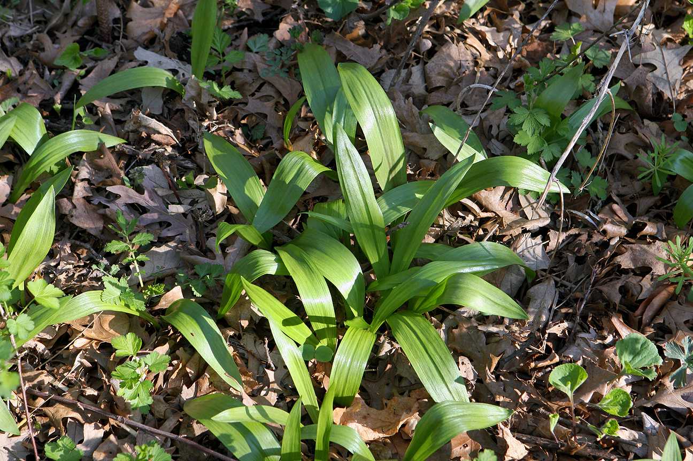

**Identification**: Broad, smooth lance-shaped leaves 4–10 in. long, deep green, with a reddish-pink stem base. Single most reliable feature: crush a leaf — unmistakable onion-garlic scent. No onion smell = not ramps.

**Season**: Spring only (March–May). Leaves wither before flowering.

**Edible parts**: Leaves, bulbs, and flower stalks. Entire plant is edible.

**Safety**: No toxic lookalikes share the onion scent. Lily-of-the-valley (*Convallaria majalis*) grows in similar habitat and is toxic — it lacks any onion odor.

---

### Redroot Amaranth
*Amaranthus retroflexus*

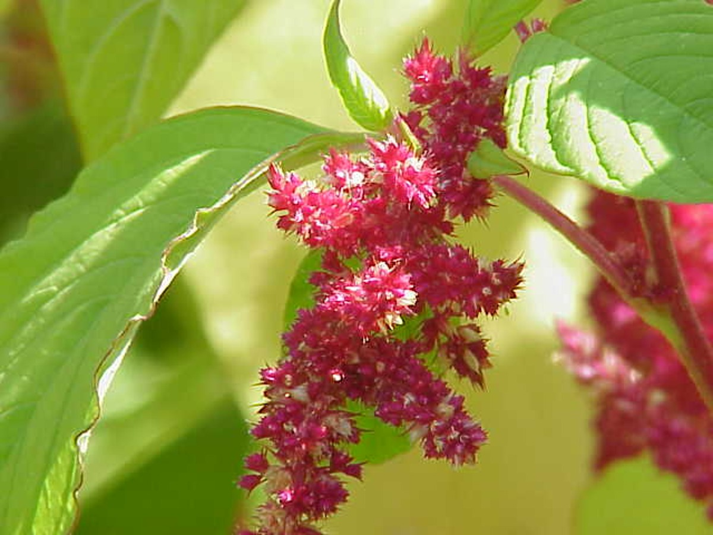

**Identification**: Coarse upright annual, 1–6 ft., with a distinctive dark red taproot. Leaves are dull green, oval to diamond-shaped. Dense terminal and axillary flower spikes, bristly and green. Rough-textured throughout.

**Season**: Summer through fall. Harvest young leaves in early summer; seeds in late summer.

**Edible parts**: Young leaves (cooked), seeds (dried, ground into flour).

**Safety**: Can accumulate nitrates and oxalates in quantity. Avoid plants from roadsides or heavily fertilized fields. Cook greens; do not eat raw in large amounts.

---

### Greater Burdock
*Arctium lappa*

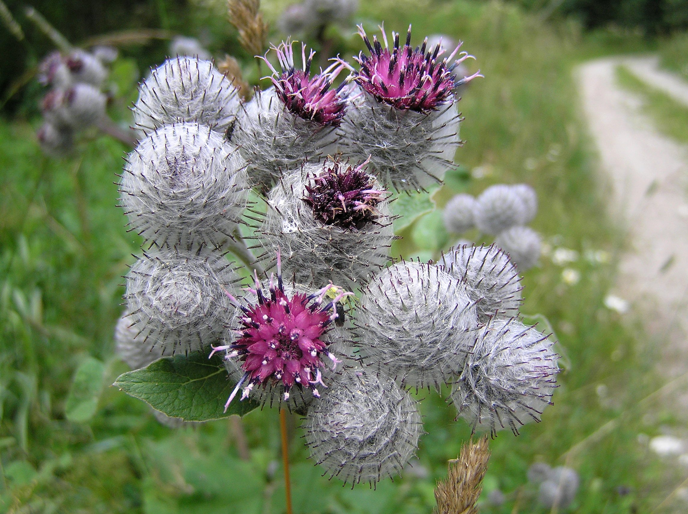

**Identification**: Giant basal leaves (up to 2 ft. wide), hollow petioles. Second-year plants produce branching stalks 4–6 ft. tall with distinctive round hooked burrs. Leaves are woolly-white beneath.

**Season**: First-year roots harvested fall through spring. Stalks and leaf stems in late spring of second year.

**Edible parts**: Roots (first year), young petioles (peeled), and young stalks (peeled). All are edible cooked.

**Safety**: Prepare roots soon after harvest — they oxidize. Pregnant women should avoid medicinal quantities. Burdock burrs entangle hair and fur but are not toxic.

---

### Common Milkweed
*Asclepias syriaca*

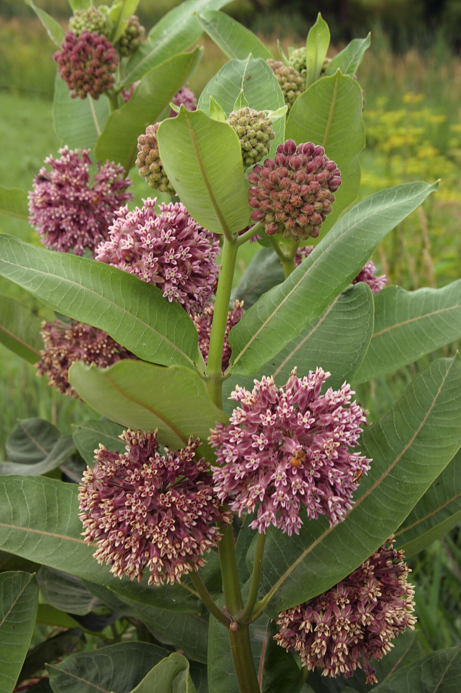

**Identification**: Stout upright stems 2–5 ft., opposite oval leaves 4–8 in. long. Stems and leaves exude white milky latex when broken. Pink-purple spherical flower clusters, followed by large warty seed pods.

**Season**: Spring shoots (when under 6 in.); flower buds and flowers in summer; immature pods (firm and under 1 in.) in midsummer.

**Edible parts**: Young shoots (cooked like asparagus), flower buds, flowers, immature pods — all must be boiled in 1–2 changes of water.

**Safety**: Raw milkweed is bitter and potentially emetic. Cooking neutralizes most compounds. Do not confuse with Dogbane (*Apocynum cannabinum*) — Dogbane has thinner opposite leaves and no milky sap from broken stems; it is toxic.

---

### Lamb's Quarters
*Chenopodium album*

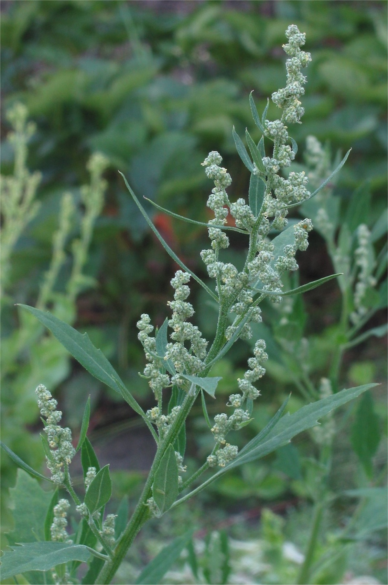

**Identification**: Upright branching annual, 1–5 ft. Leaves are diamond- to goosefoot-shaped with wavy-toothed margins, covered in white mealy powder (especially on new growth and undersides). Stems often striped red or pink.

**Season**: Spring through summer. Best when leaves are young and tender.

**Edible parts**: Young leaves and shoots (raw or cooked). Seeds dried and ground into flour.

**Safety**: High in oxalic acid — blanch or cook to reduce. Can accumulate nitrates in rich or heavily fertilized soil. Avoid large quantities raw.

---

### Chicory
*Cichorium intybus*

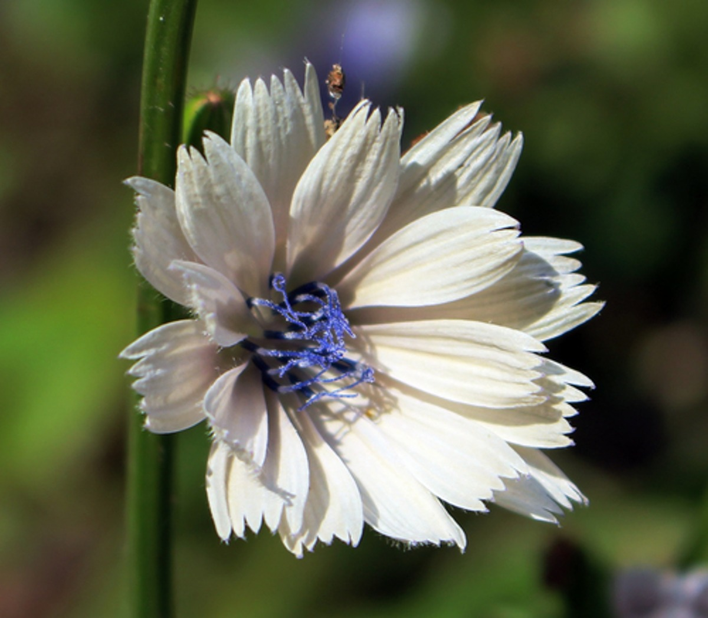

**Identification**: Stiff, branching stems 1–4 ft. with sparse leaves. Brilliant sky-blue (rarely white or pink) flowers 1–1.5 in. across, opening in morning and closing by noon. Basal leaves resemble dandelion but are coarser. Milky sap when broken.

**Season**: Roots year-round (best fall/spring). Basal leaves early spring. Flowers summer.

**Edible parts**: Roots (roasted as coffee substitute, or cooked), young basal leaves (bitter salad green), flower buds.

**Safety**: No toxic lookalikes. Some people experience skin photosensitivity from handling. The bitterness decreases with blanching or roasting.

---

### Queen Anne's Lace / Wild Carrot
*Daucus carota*

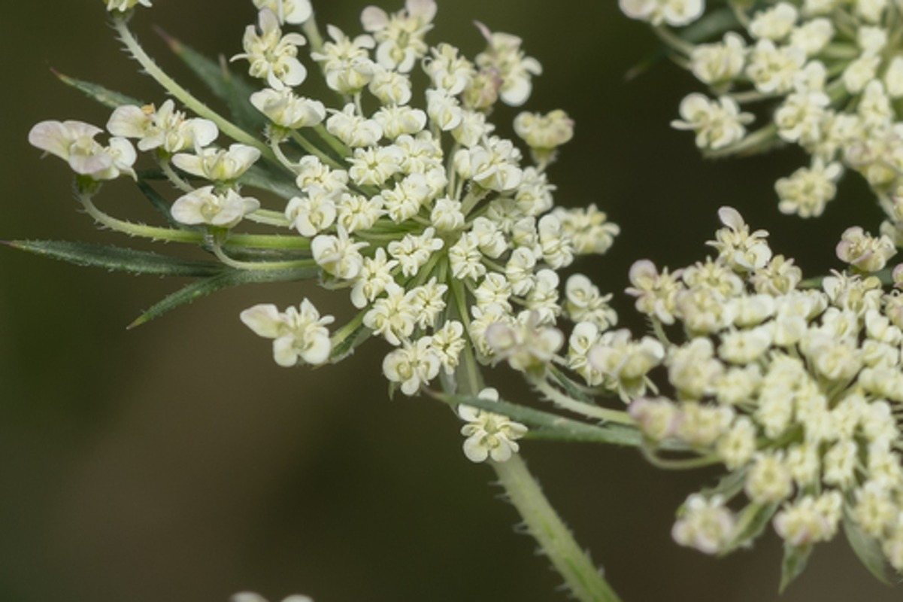

**Identification**: Flat-topped (umbel) white flower cluster 2–4 in. across, typically with one small purple-red floret at the center. Hairy stems 2–4 ft. Carrot smell from crushed leaves or root. First-year root is white, slender, carrot-scented.

**Season**: First-year roots spring or fall. Seeds in late summer.

**Edible parts**: First-year roots (white, thin, carrot-scented), seeds as seasoning.

**Safety**: CRITICAL — Poison Hemlock (*Conium maculatum*) and Water Hemlock (*Cicuta* spp.) are deadly lookalikes. Hemlock has smooth hairless stems often with purple blotching, NO carrot scent, and a fishy or unpleasant smell. Confirm: hairy stems + carrot scent before harvesting any root.

---

### Fireweed
*Chamerion angustifolium* (formerly *Epilobium angustifolium*)

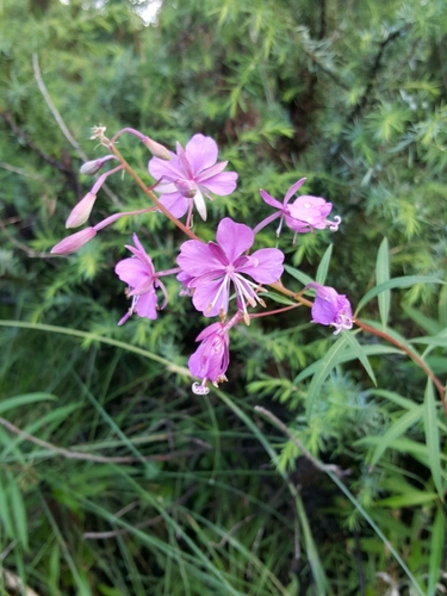

**Identification**: Tall (3–8 ft.) with alternate, willow-like leaves and distinctive bright magenta-pink flowers arranged in a long terminal spike. Often colonizes burned or disturbed areas in dense stands.

**Season**: Spring shoots when under 6 in.; young leaves throughout spring; flowers midsummer.

**Edible parts**: Young shoots (cooked like asparagus), young leaves (cooked), flowers (raw or cooked), inner pith of stems.

**Safety**: No toxic lookalikes in its habitat. Easily identified by the combination of willow-like leaves and magenta flower spike. No special preparation required.

---

### Japanese Knotweed
*Reynoutria japonica* (syn. *Fallopia japonica*)

**Identification**: Bamboo-like jointed hollow canes 5–12 ft. tall. Leaves broadly shield-shaped (truncate base), 4–6 in. long, alternate. Stems often spotted reddish-purple. Spreads aggressively in disturbed areas and riverbanks.

**Season**: Spring shoots only (when under 12 in. and before leaves unfurl). Mature plants are tough and fibrous.

**Edible parts**: Young spring shoots (cooked). Tart rhubarb-like flavor. Stems are used in sauces, chutneys, and pies.

**Safety**: No toxic lookalikes. Harvesting is encouraged as it is an invasive species — removal benefits ecosystems. Avoid plants from contaminated or heavily sprayed sites.

---

### Wild Strawberry
*Fragaria virginiana*

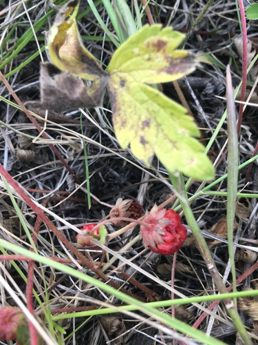

**Identification**: Low spreading plant with trifoliate leaves (three leaflets, toothed), spreading by runners. White five-petaled flowers followed by small but intensely flavored red strawberries. Leaflets have terminal tooth shorter than adjacent teeth (distinguishes from *F. vesca*).

**Season**: Flowers spring; fruit early summer (June–July).

**Edible parts**: Fruit (raw), leaves (tea, mild astringent).

**Safety**: No toxic lookalikes when fruiting. Mock strawberry (*Potentilla indica*) produces tasteless red berries with yellow flowers — not toxic, just not worth eating. Wild strawberry flowers are white.

---

### Jerusalem Artichoke / Sunchoke
*Helianthus tuberosus*

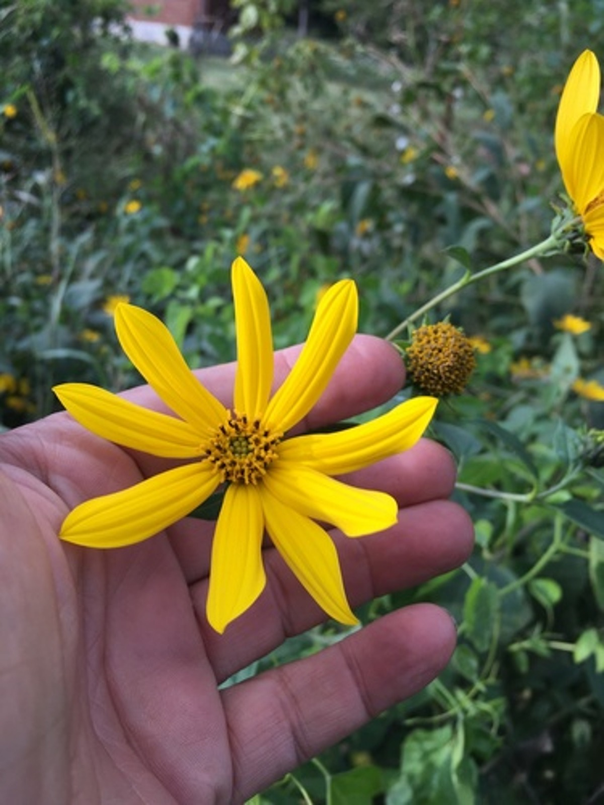

**Identification**: Tall (6–10 ft.), rough-hairy stems with alternate lance-shaped leaves in upper portion, opposite below. Small sunflower heads 2–3 in. across. Grows in dense colonies; knobby tubers form below ground.

**Season**: Tubers from late fall through winter and early spring (after frost sweetens them). Dig when plant dies back.

**Edible parts**: Tubers (raw or cooked — roasted, boiled, or eaten like potatoes).

**Safety**: Causes flatulence in many people due to inulin content. Introduce gradually. Not toxic; no dangerous lookalikes when tubers are dug in context of the dead plant stalks.

---

### Watercress
*Nasturtium officinale*

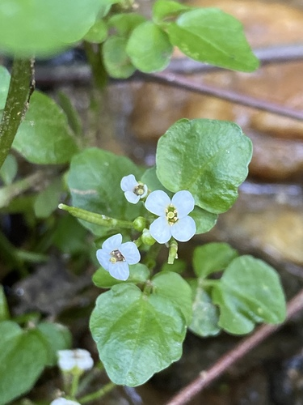

**Identification**: Aquatic or semi-aquatic perennial in flowing, cold, clear water. Pinnately compound leaves with rounded leaflets; the terminal leaflet is the largest. Stems hollow and floating. Small white four-petaled flowers in clusters.

**Season**: Year-round in running water; best in cool weather (spring and fall).

**Edible parts**: Leaves and stems (raw in salads or cooked). Peppery, mustard-like flavor.

**Safety**: Harvest only from fast-moving, clean water. Stagnant water sources may harbor Giardia and other pathogens. Watercress from agricultural drainage can carry liver fluke. Cook watercress from any water source you cannot verify as clean.

---

### Yellow Wood Sorrel
*Oxalis stricta*

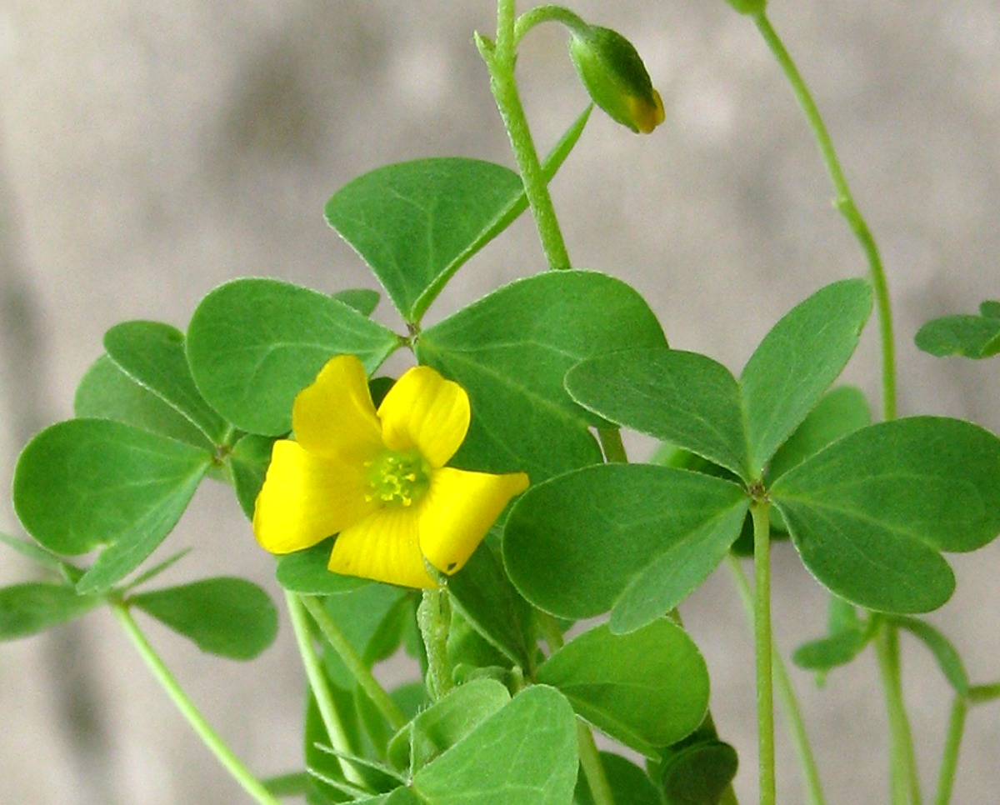

**Identification**: Small plant 4–12 in. with distinctive heart-shaped (notched) trifoliate leaflets that fold down at night. Small yellow five-petaled flowers. Thin cylindrical seed pods that eject seeds explosively when ripe.

**Season**: Spring through fall. Available most of the growing season.

**Edible parts**: Leaves, stems, and flowers (all raw as a tart trail nibble or salad addition).

**Safety**: High in oxalic acid — avoid large quantities, especially if prone to kidney stones. Not dangerous in typical trail amounts. Do not confuse with clover (*Trifolium* spp.) — clover leaflets are oval with no notch, and flowers are completely different.

---

### Purslane
*Portulaca oleracea*

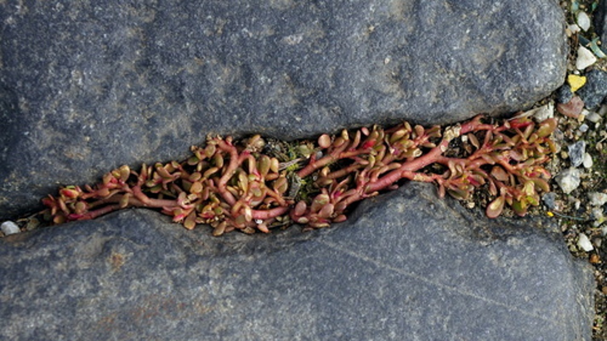

**Identification**: Low-growing, fleshy succulent with reddish stems forming mats. Leaves are spatula-shaped (paddle-like), thick, smooth, and arranged alternately or in clusters. Small yellow five-petaled flowers. Succulent texture throughout.

**Season**: Summer through early fall. Best in hot weather.

**Edible parts**: Leaves, stems, and flowers (raw or cooked). One of the highest plant sources of omega-3 fatty acids.

**Safety**: Mild oxalic acid content. Spurge (*Euphorbia* spp.) is a toxic lookalike — spurge exudes white milky sap when broken; purslane has clear watery sap. Always check for sap before eating.

---

### Chickweed
*Stellaria media*

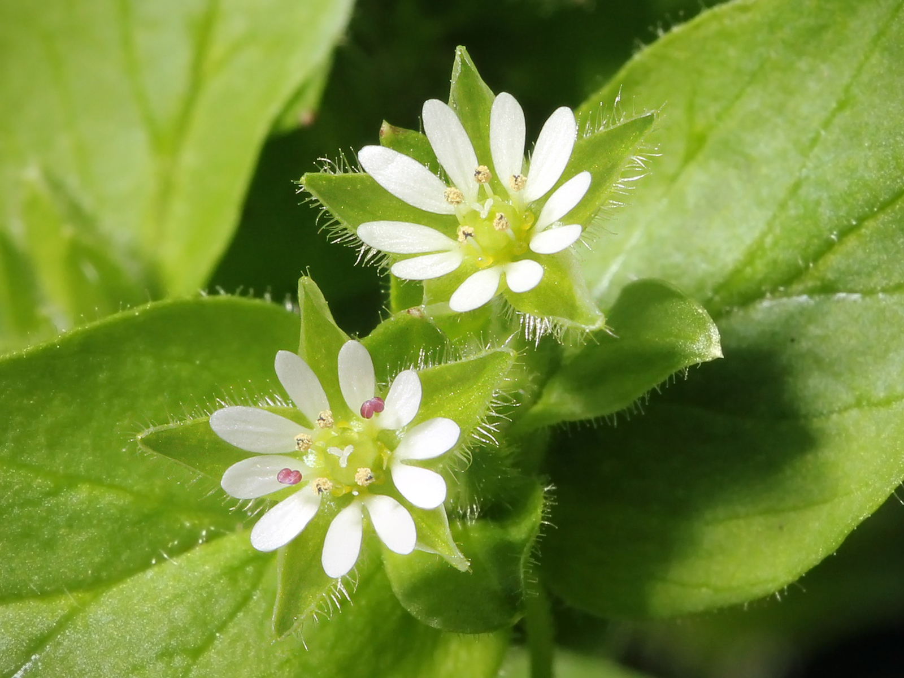

**Identification**: Low-growing, often forming dense mats. Small oval leaves, opposite. Single line of hairs running along one side of the stem (rotates at each node). Tiny white star-shaped flowers with deeply notched petals that appear to be 10 petals but are actually 5.

**Season**: Cool weather — spring and fall in most regions; year-round in mild climates.

**Edible parts**: Entire above-ground plant (raw or lightly cooked). Mild, pleasant flavor.

**Safety**: No toxic lookalikes when the single hair-line on the stem is confirmed. Scarlet Pimpernel (*Anagallis arvensis*) grows in similar habitat but has orange-red flowers and no hair line — it is mildly toxic.

---

### Dandelion
*Taraxacum officinale*

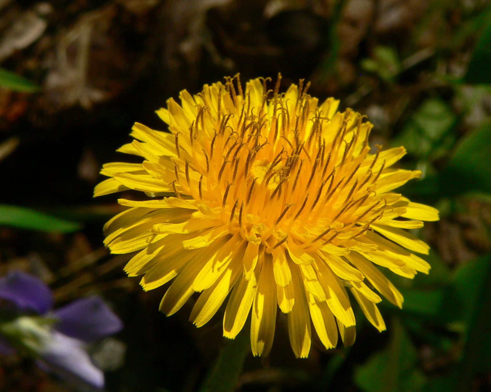

**Identification**: Basal rosette of deeply toothed (runcinate) leaves, all parts with milky sap. Single golden-yellow composite flower heads on hollow scapes. Distinctive spherical seed head (clock) disperses by wind. Tap-rooted.

**Season**: Year-round. Leaves best in early spring (less bitter). Roots best fall through spring.

**Edible parts**: Leaves (raw or cooked), flowers (raw, fritters, wine), roots (roasted coffee substitute or cooked). Entire plant is edible.

**Safety**: No toxic lookalikes. Cat's-ear (*Hypochaeris radicata*) is sometimes confused — it has hairy leaves and branching flower stems, but is also edible. Dandelion leaves are glabrous (smooth).

---

### Cattail / Bulrush
*Typha latifolia*

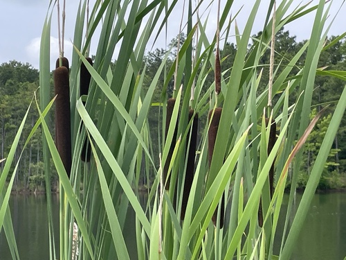

**Identification**: Tall wetland plant 5–9 ft. Flat, spongy, sword-like leaves. The brown cylindrical "hotdog-on-a-stick" seed head is unmistakable. Male flower cluster is immediately above the female (brown) cylinder and releases yellow pollen in late spring.

**Season**: Spring shoots (when under 18 in.); green flower spikes (when still in sheath); pollen (late spring); starchy rootstock (fall through spring).

**Edible parts**: Young shoots (raw or cooked like corn-on-the-cob), green flower spikes (boiled), pollen (gathered fresh, used as flour substitute), rootstock starch.

**Safety**: Unmistakable — no dangerous lookalikes. Yellow Iris (*Iris pseudacorus*) may grow alongside in wetlands; it lacks the flat spongy leaves and distinctive seed head. Harvest from clean water only.

---

### Stinging Nettle
*Urtica dioica*

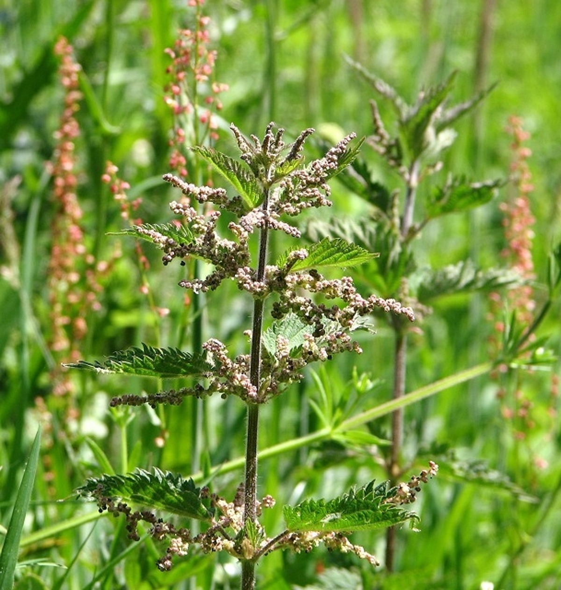

**Identification**: Upright plant 3–6 ft. with opposite, coarsely toothed, dark green leaves. Stem and leaves covered in hollow stinging hairs that inject formic acid, histamine, and other compounds on contact. Drooping catkin-like flower clusters.

**Season**: Young spring shoots before flowering (under 12 in.). After flowering, leaves become gritty and high in cystoliths; avoid.

**Edible parts**: Young leaves and shoots (cooked — blanching or cooking completely neutralizes the sting). One of the most nutritious wild greens.

**Safety**: Wear gloves to harvest. Once cooked, completely safe. No toxic lookalikes once stinging hairs are confirmed. Dead Nettle (*Lamium* spp.) resembles nettle but has no stinging hairs and is in a completely different family — also edible.

---

## Photo Credits

All habit photographs in this guide are sourced from Wikimedia Commons under Creative Commons licenses. The table below provides full attribution as required by the respective licenses.

**License abbreviations used:**
- CC0 — Public domain dedication, no attribution required (included here for completeness)
- CC BY-SA — Creative Commons Attribution-ShareAlike. You may use and adapt for any purpose including commercial, provided you credit the author and license derivatives under the same terms.

| Species | Common Name | Filename | Source URL | License | Notes |
|---------|-------------|----------|------------|---------|-------|
| *Allium tricoccum* | Ramps / Wild Leek | allium-tricoccum-habit.jpg | https://upload.wikimedia.org/wikipedia/commons/9/97/Wild_Leeks6.jpeg | CC BY-SA (Wikimedia Commons) | |
| *Amaranthus retroflexus* | Redroot Amaranth | amaranthus-retroflexus-habit.jpg | https://upload.wikimedia.org/wikipedia/commons/9/91/Amaranthus_tricolor0.jpg | CC BY-SA (Wikimedia Commons) | |
| *Arctium lappa* | Greater Burdock | arctium-lappa-habit.jpg | https://upload.wikimedia.org/wikipedia/commons/c/ca/ArctiumLappa1.jpg | CC BY-SA (Wikimedia Commons) | |
| *Asclepias syriaca* | Common Milkweed | asclepias-syriaca-habit.jpg | https://upload.wikimedia.org/wikipedia/commons/7/77/Asclepias_syriacus.tif | CC BY-SA (Wikimedia Commons) | |
| *Chenopodium album* | Lamb's Quarters | chenopodium-album-habit.jpg | https://upload.wikimedia.org/wikipedia/commons/b/b7/Melganzenvoet_bloeiwijze_Chenopodium_album.jpg | CC BY-SA (Wikimedia Commons) | |
| *Cichorium intybus* | Chicory | cichorium-intybus-habit.jpg | https://upload.wikimedia.org/wikipedia/commons/b/bf/Illustration_Cichorium_intybus0_clean.jpg | CC BY-SA (Wikimedia Commons) | |
| *Daucus carota* | Queen Anne's Lace | daucus-carota-habit.jpg | https://upload.wikimedia.org/wikipedia/commons/2/23/Daucus_carota_May_2008-1_edit.jpg | CC BY-SA (Wikimedia Commons) | |
| *Chamerion angustifolium* | Fireweed | epilobium-angustifolium-habit.jpg | https://upload.wikimedia.org/wikipedia/commons/1/1d/Maitohorsma_(Epilobium_angustifolium).JPG | CC BY-SA (Wikimedia Commons) | |
| *Reynoutria japonica* | Japanese Knotweed | fallopia-japonica-habit.jpg | https://upload.wikimedia.org/wikipedia/commons/0/0a/Reynoutria_japonica_in_Brastad_1.jpg | CC BY-SA (Wikimedia Commons) | Original 9.8 MB; compressed to 0.20 MB for PDF embedding |
| *Fragaria virginiana* | Wild Strawberry | fragaria-virginiana-habit.jpg | https://upload.wikimedia.org/wikipedia/commons/a/a9/Fragaria_virginiana_2427.JPG | CC BY-SA (Wikimedia Commons) | |
| *Helianthus tuberosus* | Jerusalem Artichoke | helianthus-tuberosus-habit.jpg | https://upload.wikimedia.org/wikipedia/commons/a/ae/Sunroot_top.jpg | CC BY-SA (Wikimedia Commons) | |
| *Nasturtium officinale* | Watercress | nasturtium-officinale-habit.jpg | https://upload.wikimedia.org/wikipedia/commons/d/dd/Watercress_(2).JPG | CC BY-SA (Wikimedia Commons) | |
| *Oxalis stricta* | Yellow Wood Sorrel | oxalis-stricta-habit.jpg | https://upload.wikimedia.org/wikipedia/commons/9/91/6h_common_yellow_oxalis.jpg | CC BY-SA (Wikimedia Commons) | |
| *Portulaca oleracea* | Purslane | portulaca-oleracea-habit.jpg | https://upload.wikimedia.org/wikipedia/commons/2/2f/Portulaca_oleracea.jpg | CC BY-SA (Wikimedia Commons) | |
| *Stellaria media* | Chickweed | stellaria-media-habit.jpg | https://upload.wikimedia.org/wikipedia/commons/0/05/Kaldari_Stellaria_media_01.jpg | CC0 | Author: Kaldari (Wikimedia Commons) |
| *Taraxacum officinale* | Dandelion | taraxacum-officinale-habit.jpg | https://upload.wikimedia.org/wikipedia/commons/4/4f/DandelionFlower.jpg | CC BY-SA 3.0 | Author: Greg Hume (Greg5030, Wikimedia Commons) |
| *Typha latifolia* | Cattail / Bulrush | typha-latifolia-habit.jpg | https://upload.wikimedia.org/wikipedia/commons/4/4c/Bulrush_(Typha_latifolia)_(8139113636).jpg | CC BY-SA (Wikimedia Commons) | |
| *Urtica dioica* | Stinging Nettle | urtica-dioica-habit.jpg | https://upload.wikimedia.org/wikipedia/commons/6/6f/Fen_nettle_(Urtica_dioica_ssp._galeopsifolia)_-_geograph.org.uk_-_5423125.jpg | CC BY-SA (Wikimedia Commons) | |

All photos are from Wikimedia Commons (https://commons.wikimedia.org). CC BY-SA images are reproduced here under the Creative Commons Attribution-ShareAlike license. This PDF and any derivatives must credit photographers as noted above and be distributed under the same CC BY-SA terms for the photo content. The text of this guide is copyright Seedwarden.

---

*Wild Edibles Quick Reference — Seedwarden — seedwarden.co*
